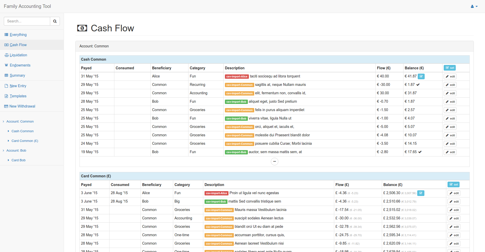

Family Accounting Tool
======================

[](https://github.com/nymanjens/facto/actions)

Familiy Accounting Tool keeps track of every transaction your family makes. Its goal is to:

- Extract usefull statistics from the data<br>
  _E.g.: How much is spent on food each month?_
- Calculate internal debt<br>
  _E.g.: Alice buys toilet paper for the whole family with her own money. This tool then registers
  that the family ows Alice the cost of the toilet paper._
- Provide a way to check if no money is disappearing in unexpected expenses<br>
  _E.g.: You will notice when there are hidden banking costs_

## Screenshot



## Installation from release

- Download "Binaries (compiled files) with demo configuration" from the [latest
  release](https://github.com/nymanjens/facto/releases)
- Unpack the archive
- Open `conf/application.conf` in the unpacked folder:
  - Configure a database. The easiest way is to set up a MariaDB server locally,
    create an empty database called `facto` and configure it as follows:

```
db.default {
  driver = com.mysql.jdbc.Driver
  url = "jdbc:mysql://localhost/facto?user=mysqluser&password=mysqlpassword"
  slick.profile = "slick.jdbc.MySQLProfile$"
}
```

  - Choose secret values for `play.http.secret.key` and `app.setup.defaultPassword`

- Open a terminal in the unpacked folder
- Run following commands to get the app running:

    ```
    # Create database tables
    bin/server -DdropAndCreateNewDb

    # Create admin user
    bin/server -DcreateAdminUser

    # Run application
    bin/server
    ```

- Browse to http://localhost:9000/app/useradministration (username: "admin", password: "changeme")

## Installation with Docker (discouraged)

**Warning:** The following works fine for launching a demo server to have a look.
But if you want to run this as a service with real data and custom
configuration, it is recommended to follow the "Installation from release"
section instead (see [this issue](https://github.com/nymanjens/facto/issues/4)
for the reasons why).

The following commands will launch a new server alongside a database in Docker containers:

```
# Get the docker-compose.yml file
wget https://raw.githubusercontent.com/nymanjens/facto/master/docker-compose.yml

# Choose a unique random string here of sufficient length
export APPLICATION_SECRET="$(cat /dev/urandom | tr -dc 'a-zA-Z0-9' | fold -w 32 | head -n 1)"

# Create an empty database with a single admin user
docker-compose run web sleep 5 # Wait for the database to be ready
docker-compose run web bin/server -DdropAndCreateNewDb
docker-compose run web bin/server -DcreateAdminUser

# Bring up the server
docker-compose up
```

When done, browse to http://localhost:9000/ (username: "admin", password: "changeme")

## Configuration
- `conf/application.conf`:<br>
  Setup and configure a database here.
- Add users:<br>
  A default user is created with the `-DcreateAdminUser` flag (username: admin, password:
  changeme). This account can create new users.
- `conf/accounting-config.yml`:<br>
  Edit this file to reflect your situation and preferences. Note that
  `userLoginName` has to refer to a user that already exists in the database
  (see previous point)

## Usage
To effectively use this tool, you must learn to input the transactions correctly. Therefore,
it's important to understand the meaning of categories and accounts.

### Categories
These are used to split up your expenses into categories. Every account has some special
special categories:

- **Accounting category:**<br>
  Used for non-real income/expenses. This category will be ignored when analysing the montly
  surplus/deficit in terms of expenses. Use this category e.g. when the expense will be payed
  back by your employer
- **Endowment category:**<br>
  Used for money transfer to the common account (see example in the next section)

### Accounts
An account can refer to a regular person or the common account.

**Example:**

A family has two members: Alice and Bob. There will be three accounts:

- Alice
- Bob
- The common account

Alice and Bob will regularly transfer money to the common account which can be used to make
common expenses. This transfer to the common account is called an _'endowment'_.

### Inputting transactions
Special fields:

- **Beneficiary:**<br>
  In case of an expense: The one that will benefit from the expense<br>
  In case of an income: The one that was paid
- **Payed with/to:**<br>
  In case of an expense: Payed with<br>
  In case of an income: Payed to
- **Flow:**<br>
  In case of an expense: Negative number representing the price<br>
  In case of an income: Positive number

### Using the Cash Flow overview effectively
The cash flow overview is a powerfull tool to check for unaccounted expenses.

You should:

- Set the current amount of money you have for every payment method (cash, card, ...).
  You can do this by using the _"set"_ button.
- Whenever you perform a transaction, the balance will be updated automatically.
- You can re-count your cash and see if it matches the calculated value.
  If it does, you can use the checkbox button to mark this.
  If it doesn't, you have made an error or lost money.

## Special thanks

To the sponsor of this project: @indeedeng
